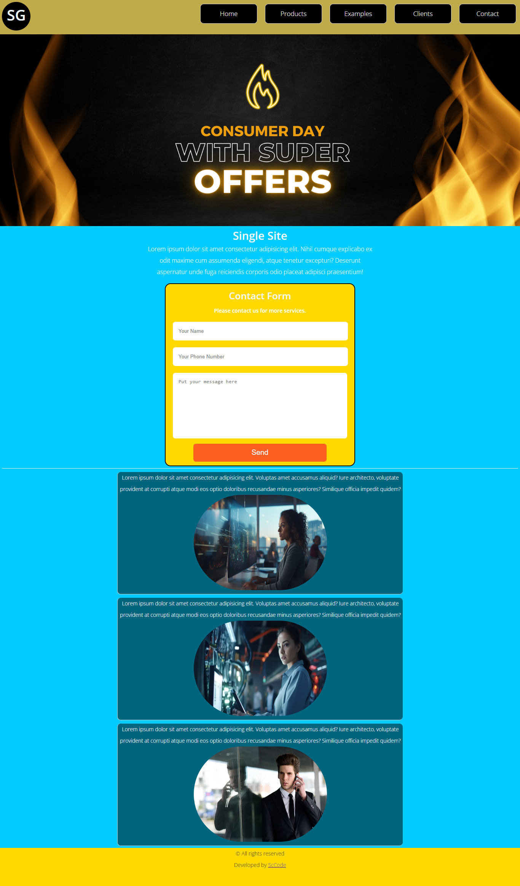

English version ===

# Single Site



🌐 Welcome to Single Site! This is a simple and elegant website template designed by [ScCode](https://www.sccode.tech).

## Table of Contents
- [Introduction](#introduction)
- [Features](#features)
- [Contact](#contact)
- [Get Started](#get-started)
- [License](#license)

## Introduction

Single Site is a stylish and responsive website template that you can use for various purposes. It provides a clean and modern design, making it easy for visitors to navigate and explore your content.

## Features

- 🖼️ Beautiful Banner
- 📜 Informative Sections
- 📧 Contact Form
- 📦 Easy to Customize

## Contact

Have questions or want to get in touch? Feel free to reach out through our contact form or visit our [website](https://www.sccode.tech).

## Get Started

1. **Clone the Repository:**
   ```bash
   git clone # Single Site

🌐 Welcome to Single Site! This is a simple and elegant website template designed by [ScCode](https://www.sccode.tech).

## Table of Contents
- [Introduction](#introduction)
- [Features](#features)
- [Contact](#contact)
- [Get Started](#get-started)
- [License](#license)

## Introduction

Single Site is a stylish and responsive website template that you can use for various purposes. It provides a clean and modern design, making it easy for visitors to navigate and explore your content.

## Features

- 🖼️ Beautiful Banner
- 📜 Informative Sections
- 📧 Contact Form
- 📦 Easy to Customize

## Contact

Have questions or want to get in touch? Feel free to reach out through our contact form or visit our [website](https://www.sccode.tech).

## Get Started

1. **Clone the Repository:**
   ```bash
   git clone https://github.com/your-username/your-repository.git

Feel free to customize it further based on your specific needs. If you have any questions or need more assistance, let me know!


Versão Em Português ===

